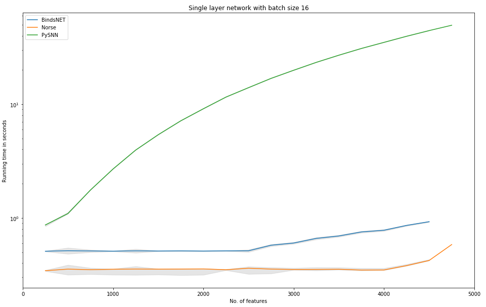
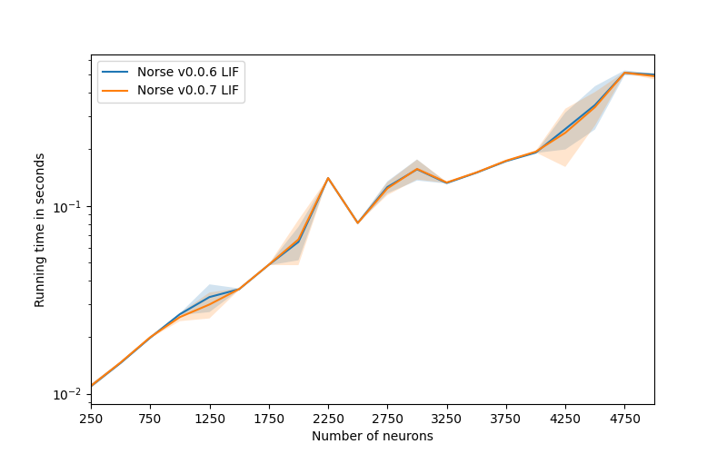

This benchmarking package provides preliminary comparisons to 
other spike-based deep learning approaches.
We plan to extend it with more benchmarks in the immediate future.
On a longer timescale, we hope to document the improved quality and speed
of Norse by comparing future performance with past releases.

## LIF benchmark comparison with Norse, BindsNET, and GeNN
BindsNET and GeNN are two of the closest competitors in the SNN space - at
least in terms of performance.
The graph below shows a benchmark between Norse, BindsNET, and GeNN simulating
poisson encoded input to a linearly weighted layer of LIF neurons. The simulation ran on a
AMD Ryzen Threadripper 3960X 24-Core machine with a NVIDIA RTX 3090 24 GB RAM GPU for 1000 
timesteps with a time-delta of 0.001 seconds and a batch-size of 32.
Each line indicates the mean runtime out of 5 repeated runs, with 2 standard deviations (~95%) engraved.

The benchmark indicates that for a single layer of <= 5000 LIF neurons, Norse outperforms BindsNET by a factor of >10, rivals GeNN for smaller layers, but fails to keep up with GeNN's precompiled GPU code for larger layers.

## LIF benchmark between Norse versions
We continuously strive to improve the performance of Norse.
The graph below shows how long it takes to simulate a single layer of LIF neurons - the smaller the better.
Note that this benchmark has been run on an NVIDIA RTX 2060 with 6GB of RAM, which is much slower than the 3090 used for the above benchmarks.

