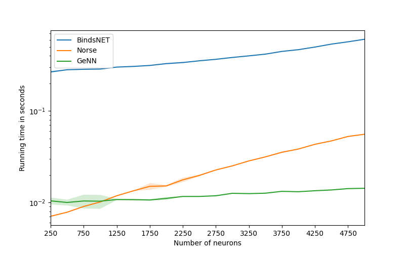

This benchmarking package provides preliminary comparisons to 
other spike-based deep learning approaches.
We plan to extend it with more benchmarks in the immediate future.
On a longer timescale, we hope to document the improved quality and speed
of Norse by comparing future performance with past releases.

## LIF benchmark comparison with Norse, BindsNET, and GeNN
BindsNET and GeNN are two of the closest competitors in the SNN space - at
least in terms of performance.
The graph below shows a benchmark between Norse, BindsNET, and GeNN simulating
poisson encoded input to a single layer of LIF neurons. The simulation ran on a
AMD Ryzen Threadripper 3960X 24-Core machine with a NVIDIA RTX 3090 24 GB RAM GPU for 1000 
timesteps with a time-delta of 0.001 seconds and a batch-size of 32.
Each line indicates the mean running time out of 20 repeated runs and the coloured
area indicates where ~95% of the runtimes fell.

The benchmark indicates that for a single layer of <= 5000 LIF neurons, Norse outperforms BindsNET by a factor of 2, but fails to beat the precompiled models in GeNN by a factor of ~10.

